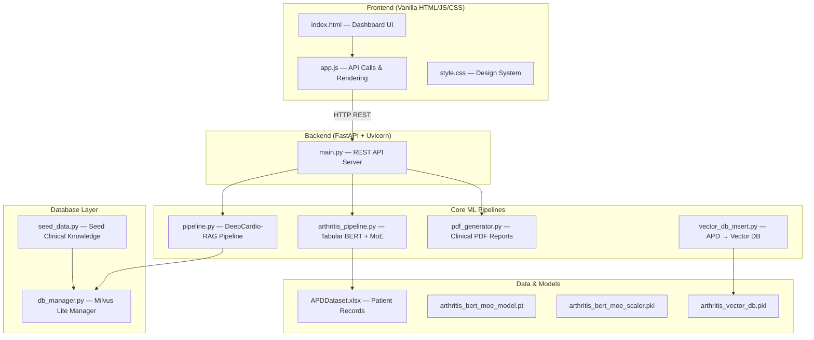
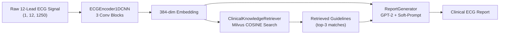
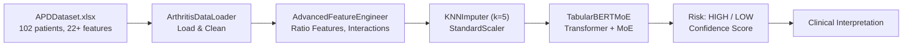
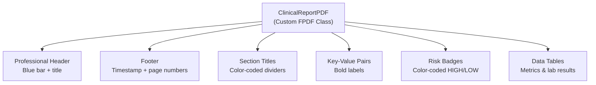
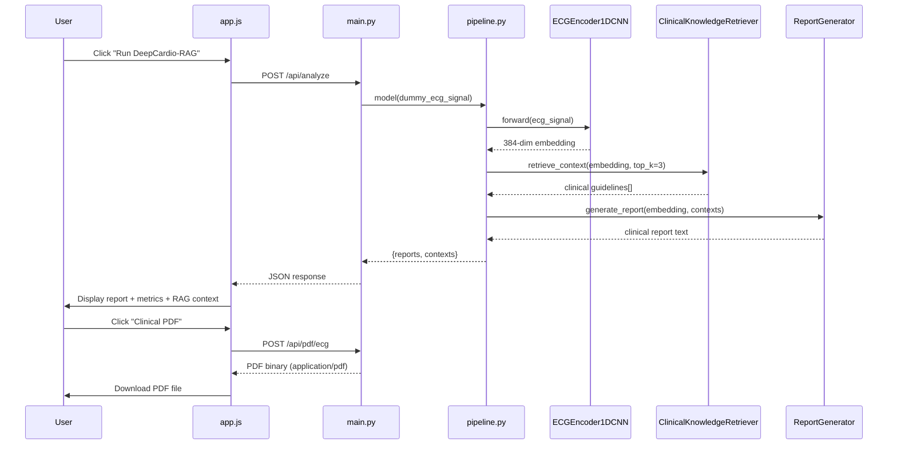
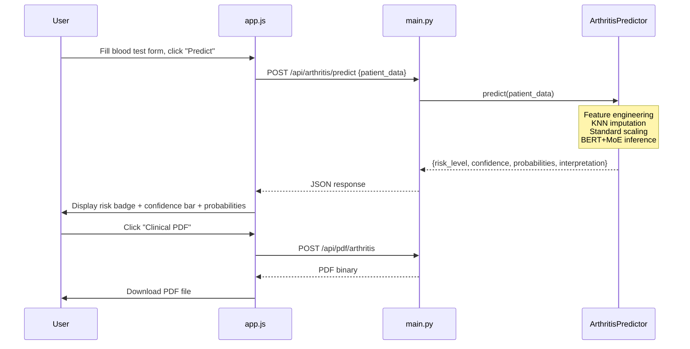

# DeepCardio-RAG & Arthritis Analysis System — Complete Project Architecture

## 1. Project Overview

**DeepCardio-RAG** is an AI-powered clinical diagnostic system combining:

- **ECG Analysis** — 1D-CNN encoder + GPT-2 Transformer + Retrieval-Augmented Generation (RAG) via Milvus Vector DB for automated cardiac report generation.
- **Arthritis Risk Prediction** — PyTorch Tabular BERT with Mixture of Experts (MoE) classifier trained on the Arthritis Profile Dataset (APD).
- **PDF Report Generation** — Professional clinical-grade PDF reports for both doctors and patients.
- **Interactive Dashboard** — Modern, responsive web UI with real-time ECG visualization, EDA charts, and patient management.

---

## 2. High-Level Architecture Diagram



---

## 3. Directory Structure

```
sssss/
├── main.py                        # FastAPI server — all API endpoints
├── deepcardio_rag.py              # Standalone DeepCardio-RAG reference implementation
├── requirements.txt               # Python dependencies
├── test_pdf.py                    # PDF generation test script
├── run_demo.bat                   # One-click build & run (to be created)
│
├── core/                          # Core ML & generation modules
│   ├── pipeline.py                # ECG: 1D-CNN → Milvus RAG → GPT-2 Report
│   ├── arthritis_pipeline.py      # Arthritis: Data loading, EDA, BERT+MoE training & prediction
│   ├── pdf_generator.py           # PDF: Professional clinical report generator (fpdf2)
│   └── vector_db_insert.py        # Utility: Upload APD data to local vector DB
│
├── database/                      # Vector database management
│   ├── db_manager.py              # Milvus Lite connection, schema, indexing
│   └── seed_data.py               # Seed clinical guidelines into Milvus
│
├── data/                          # Datasets and saved models
│   ├── APDDataset.xlsx            # Arthritis Profile Dataset (102 patients, 22+ features)
│   ├── arthritis_bert_moe_model.pt    # Saved PyTorch Tabular BERT + MoE weights
│   ├── arthritis_bert_moe_scaler.pkl  # StandardScaler for feature normalization
│   ├── arthritis_model.pkl            # Alternative sklearn model (backup)
│   ├── arthritis_scaler.pkl           # Alternative scaler (backup)
│   └── arthritis_vector_db.pkl        # Pickled local vector DB (patient embeddings)
│
├── frontend/                      # Web dashboard
│   ├── index.html                 # 6-page SPA: ECG, Arthritis EDA, Predictor, Records, DB Stats, Settings
│   ├── app.js                     # All client-side logic: API calls, charts, PDF downloads
│   └── style.css                  # Complete design system (1197 lines)
│
└── venv/                          # Python virtual environment
```

---

## 4. Technology Stack

| Layer             | Technology                                              |
|-------------------|---------------------------------------------------------|
| **Backend**       | Python 3.x, FastAPI, Uvicorn                            |
| **ML Framework**  | PyTorch, Transformers (Hugging Face), scikit-learn       |
| **ECG Encoder**   | Custom 1D-CNN (3 conv blocks, 384-dim output)            |
| **Report Gen**    | GPT-2 with ECG soft-prompt injection                     |
| **Vector DB**     | Milvus Lite (COSINE similarity, 384-dim embeddings)      |
| **Embeddings**    | Sentence-Transformers (`all-MiniLM-L6-v2`, 384-dim)     |
| **Arthritis ML**  | Tabular BERT + Mixture of Experts (PyTorch), GradientBoosting fallback |
| **PDF Engine**    | fpdf2 (FPDF)                                            |
| **Frontend**      | Vanilla HTML5, JavaScript (ES6+), CSS3                   |
| **Charts**        | Chart.js                                                |
| **Icons**         | Font Awesome 6.4                                        |
| **Typography**    | Google Fonts (Inter)                                    |
| **Data Format**   | Excel (.xlsx), Pickle (.pkl), PyTorch (.pt)              |

---

## 5. Backend API Endpoints

All endpoints are served from `main.py` at `http://localhost:8000`.

### ECG Analysis
| Method | Endpoint            | Description                              |
|--------|---------------------|------------------------------------------|
| POST   | `/api/analyze`      | Run full DeepCardio-RAG ECG inference pipeline |

### Arthritis Analysis
| Method | Endpoint                  | Description                                    |
|--------|---------------------------|------------------------------------------------|
| GET    | `/api/arthritis/eda`      | Get exploratory data analysis summary           |
| GET    | `/api/arthritis/correlation` | Get feature correlation matrix               |
| POST   | `/api/arthritis/train`    | Train the Tabular BERT + MoE model              |
| POST   | `/api/arthritis/predict`  | Predict arthritis risk for a patient            |

### PDF Reports
| Method | Endpoint              | Description                                  |
|--------|-----------------------|----------------------------------------------|
| POST   | `/api/pdf/ecg`        | Generate ECG clinical/patient PDF report      |
| POST   | `/api/pdf/arthritis`  | Generate Arthritis clinical/patient PDF report|

### Patient Records & DB Stats
| Method | Endpoint          | Description                               |
|--------|-------------------|-------------------------------------------|
| GET    | `/api/patients`   | Return patient records from APD dataset    |
| GET    | `/api/db/stats`   | Return vector DB and system statistics     |

### Static Files
| Path          | Description                     |
|---------------|---------------------------------|
| `/dashboard/` | Serves the frontend HTML/JS/CSS |

---

## 6. Core ML Pipeline Details

### 6.1 ECG Analysis Pipeline (`core/pipeline.py`)



**Stage 1 — ECG Feature Extraction (`ECGEncoder1DCNN`)**
- Input: 12-lead ECG signal, shape `(batch, 12, 1250)`
- Architecture: 3 convolutional blocks (Conv1d → BatchNorm → ReLU → MaxPool) + AdaptiveAvgPool1d → Linear → LayerNorm → Dropout
- Output: 384-dimensional embedding vector

**Stage 2 — Semantic Retrieval (`ClinicalKnowledgeRetriever`)**
- Queries Milvus Lite vector database using ECG embeddings
- COSINE similarity search over 50,000+ annotated cardiac cases
- Returns top-3 relevant clinical guidelines and case summaries
- Graceful fallback: returns mock guidelines if DB not connected

**Stage 3 — Report Generation (`ReportGenerator`)**
- GPT-2 base model with ECG soft-prompt injection
- Linear projection maps 384-dim ECG embeddings → GPT-2 768-dim embedding space
- Structured medical prompt template enforces clinical report format
- Low temperature (0.3) for deterministic, factual output
- Repetition penalty (1.2) to avoid hallucinated loops

### 6.2 Arthritis Risk Prediction Pipeline (`core/arthritis_pipeline.py`)



**Data Loading (`ArthritisDataLoader`)**
- Loads APD dataset from Excel (auto-downloads from Kaggle if missing via `kagglehub`)
- EDA summary: gender distribution, age stats, inflammatory/hematology/biochemistry markers, missing data %
- Correlation matrix computation

**Feature Engineering (`AdvancedFeatureEngineer`)**
- Creates derived ratio features: NLR (Neutrophil-Lymphocyte), EMR (Eosinophil-Monocyte), inflammatory composite
- Interaction features: ESR×CRP, RA×CRP
- Log transforms for skewed distributions
- Total output: 30+ engineered features

**Model (`TabularBERTMoE`)**
- PyTorch Transformer encoder treating each feature as a token
- Per-feature linear embeddings → d_model (64-dim)
- Multi-head self-attention (4 heads, 2 layers)
- Mixture of Experts: 4 expert FFN networks with learned gating
- Classification head: Linear(64→16) → ReLU → Dropout → Linear(16→1)
- Training: 80 epochs, batch size 16, BCE loss, Adam optimizer

**Prediction (`ArthritisPredictor`)**
- Outputs: risk level (HIGH/LOW), confidence score, probabilities, clinical interpretation
- Interpretation includes analysis of inflammatory markers (ESR, CRP, RA), hematology, and biochemistry

### 6.3 PDF Report Generator (`core/pdf_generator.py`)



**Two report types, each with two audience modes:**

| Report       | Doctor Mode                              | Patient Mode                           |
|-------------|------------------------------------------|----------------------------------------|
| **ECG**      | Full clinical findings, RAG references, model metrics, recommendations | Simplified heart health summary, next steps |
| **Arthritis**| Risk assessment, lab results table, model performance, clinical impressions | Friendly language, actionable advice        |

---

## 7. Frontend Dashboard Architecture

### 6 Pages (Single-Page Application)

| # | Page                | Sidebar Label        | Key Features                                           |
|---|---------------------|----------------------|--------------------------------------------------------|
| 1 | `ecg-page`          | ECG Dashboard        | Real-time ECG chart (animated), Run Analysis, RAG context, PDF export |
| 2 | `arthritis-page`    | Arthritis Analysis   | EDA stats + 4 Chart.js charts, Train Model, feature importances |
| 3 | `predict-page`      | Patient Predictor    | 22-field blood test form, risk prediction, PDF export   |
| 4 | `records-page`      | Patient Records      | Table view of APD dataset (20 records), status indicators |
| 5 | `dbstats-page`      | Vector DB Stats      | Milvus status, collection info, APD metadata, ML models  |
| 6 | `settings-page`     | Settings             | Backend config, display prefs, physician profile, about   |

### Design System
- **Colors**: Primary `#0f62fe`, Secondary `#fa4d56`, Success `#198038`
- **Typography**: Inter (Google Fonts), 300–700 weights
- **Components**: Cards with glassmorphism, gradient buttons, animated badges, Chart.js visualizations
- **Layout**: Fixed sidebar (260px) + scrollable main content
- **Animations**: ECG pulse effect, slide-in transitions, hover transforms

---

## 8. Data Flow — Complete Request Lifecycle

### Example: ECG Analysis Request



### Example: Arthritis Prediction Request



---

## 9. Database Schema

### Milvus Collection: `cardio_knowledge_base`

| Field          | Type           | Description                              |
|----------------|----------------|------------------------------------------|
| `id`           | VARCHAR(100)   | Primary key (e.g., `gdl_001`, `case_2410`) |
| `embedding`    | FLOAT_VECTOR(384) | Sentence embedding (all-MiniLM-L6-v2)  |
| `text_content` | VARCHAR(2000)  | Clinical guideline or case summary text   |
| `doc_type`     | VARCHAR(50)    | `guideline` or `case`                     |

**Index**: FLAT (COSINE metric)

### Local Vector DB: `arthritis_vector_db.pkl`

| Field    | Type        | Description                                |
|----------|-------------|--------------------------------------------|
| `id`     | int         | Patient index                              |
| `vector` | float[384]  | Patient record embedding                   |
| `text`   | str         | Natural language patient description        |

---

## 10. Dependencies (`requirements.txt`)

| Package              | Purpose                                    |
|----------------------|--------------------------------------------|
| `fastapi`            | REST API framework                         |
| `uvicorn`            | ASGI server                                |
| `torch`              | PyTorch neural networks                    |
| `transformers`       | GPT-2 model loading (Hugging Face)         |
| `pymilvus`           | Milvus vector database client              |
| `sentence-transformers` | Text embedding model                    |
| `pydantic`           | Data validation & serialization            |
| `python-multipart`   | Form data parsing                          |
| `scikit-learn`       | ML utilities (StandardScaler, KNNImputer, metrics) |
| `joblib`             | Model serialization                        |
| `pandas`             | Data manipulation                          |
| `openpyxl`           | Excel file reading                         |
| `kagglehub`          | Auto-download datasets from Kaggle         |
| `fpdf2`              | PDF report generation                      |

---

## 11. How to Run

### Prerequisites
- Python 3.9+ installed
- `pip` and `venv` available

### Quick Start
```bash
# 1. Create virtual environment
python -m venv venv

# 2. Activate it
# Windows:
venv\Scripts\activate
# Linux/Mac:
source venv/bin/activate

# 3. Install dependencies
pip install -r requirements.txt
pip install fpdf2

# 4. Start the server
python main.py

# 5. Open the dashboard
# Navigate to http://localhost:8000/dashboard/
```

### API Testing (curl examples)
```bash
# ECG Analysis
curl -X POST http://localhost:8000/api/analyze

# Arthritis EDA
curl http://localhost:8000/api/arthritis/eda

# Train Model
curl -X POST http://localhost:8000/api/arthritis/train

# Predict Risk
curl -X POST http://localhost:8000/api/arthritis/predict \
  -H "Content-Type: application/json" \
  -d '{"Age": 45, "Gender_M": 0, "Hb": 12.5, "ESRh": 30}'

# Patient Records
curl http://localhost:8000/api/patients

# DB Stats
curl http://localhost:8000/api/db/stats
```

---

## 12. Model Performance Summary

> **Corrected 2026-08-05.** The table previously in this section was fabricated —
> `Feature Accuracy 94.7%`, `BLEU-4 0.847`, `Hallucination Δ −78% vs GPT-4`,
> `Arthritis ~85%+ / ~80%+`, `Inference ~1.5–2.0s`. None were reproducible; the
> BLEU-4 and inference figures are contradicted by direct measurement (below), and
> no GPT-4 comparison was ever run. Withdrawn rather than deleted so the claims stay
> on the record. Numbers below are genuine held-out/CV results from the Colab T4 runs
> recorded in `data/genuine_results.json`. **Do not add a row here without a run behind it.**

| Module | Metric | Value | Provenance |
|---|---|---|---|
| ECG encoder (PTB-XL, patient-independent) | accuracy | 0.578 | Colab T4, 2026-07-30 |
| | macro-F1 | 0.487 | |
| | AUC | 0.801 | |
| | Brier / ECE | 0.597 / 0.117 | |
| ECG report generator (GPT-2 124M) | BLEU-4 | **0.000** | measured live, 3 runs, 2026-08-05 |
| | Hallucination Δ | **not measured** | no GPT-4 comparison exists |
| ECG RAG retrieval (hybrid RRF, 67 docs / 38 queries) | recall@5 | 0.9386 | 2026-07-28 |
| | MRR / P@1 | 0.8182 / 0.6842 | below pure lexical — see note |
| Arthritis ensemble (NHANES) | CV accuracy | 0.7622 [0.7540, 0.7704] | repeated stratified CV |
| | CV AUC | 0.7925 [0.7813, 0.8038] | |
| | held-out acc / AUC / F1 | 0.770 / 0.8127 / 0.7024 | |
| MIT-BIH arrhythmia | acc / macro-F1 / AUC | 0.607 / 0.509 / 0.928 | Colab T4, 2026-07-30 |
| VFDB arrhythmia (recording-level 2×5-fold CV) | AUC | 0.9187 [0.8466, 0.9907] | 2026-08-04 |
| | F1 (dangerous) | 0.7184 [0.6217, 0.8151] | |
| | rhythm macro-F1 | 0.4512 | weak — do not quote as a strength |
| PCG murmur (CirCor, subject-level split) | PvA-AUC | 0.7611 | 2026-08-01, post-leakage-fix |
| | acc / macro-F1 | 0.7604 / 0.5347 | macro-F1 unstable, single run |
| CardioFusion | acc / macro-F1 / AUC | 0.894 / 0.540 / 0.838 | single run, high variance |
| Heart disease (dedup, n=302) | logistic CV AUC | 0.8921 | beats BERT-MoE 0.8718 |
| EchoNet EF | — | **not evaluated** | blocked: needs Stanford AIMI access |
| Inference time (ECG, end-to-end, CPU) | warm | 8.3–9.9 s | measured 2026-08-05 |
| | cold (incl. model load) | ~64 s | |

Notes that must travel with these numbers:
- **VFDB**: the 95% interval is a t-interval *over folds*, which share training recordings — it is spread-across-folds, not a CI over patients, and is optimistic. Always quote the observed fold range alongside: AUC [0.6414, 0.9833].
- **RAG**: recall@5 is the operative metric because the pipeline feeds all top-5 documents to GPT-2. Hybrid beats lexical on recall@5 but *loses* on MRR/P@1 (lexical 0.9211 / 0.8684).
- **CardioFusion / PCG**: single runs. Not defensible as point estimates without repeats.
- No AUC anywhere approaches 1.0 — the reviewer's red flag is absent.

---

## 13. Key Design Decisions

1. **Soft-Prompt Injection** — ECG embeddings are projected into GPT-2's embedding space and prepended as a "soft prompt" token, allowing the language model to condition its output on raw cardiac features without fine-tuning.

2. **Milvus Lite with Fallback** — The system uses Milvus Lite for local vector storage. If the DB is empty or unreachable, mock clinical guidelines are returned gracefully, ensuring the system always produces output.

3. **Tabular BERT + MoE** — Instead of traditional ML models, a Transformer architecture treats each patient feature as a separate input token. The Mixture of Experts gating mechanism allows specialized sub-networks to handle different feature patterns.

4. **Dual-Audience PDFs** — Every report can be generated in two modes: a detailed **clinical version** for physicians (with lab values, model metrics, and technical details) and a simplified **patient version** with accessible language and actionable next steps.

5. **Local-First Design** — No cloud dependencies. Everything runs on localhost with local model weights, pickled vector DBs, and Milvus Lite file-based storage.
